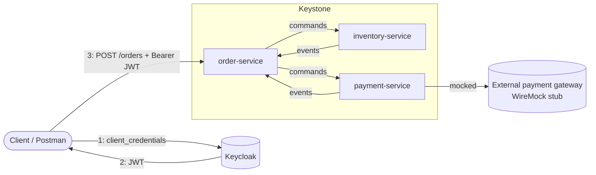
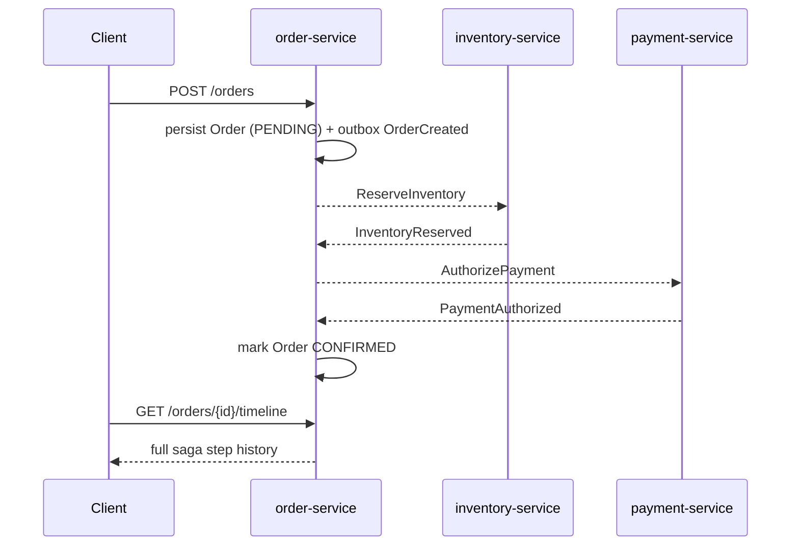
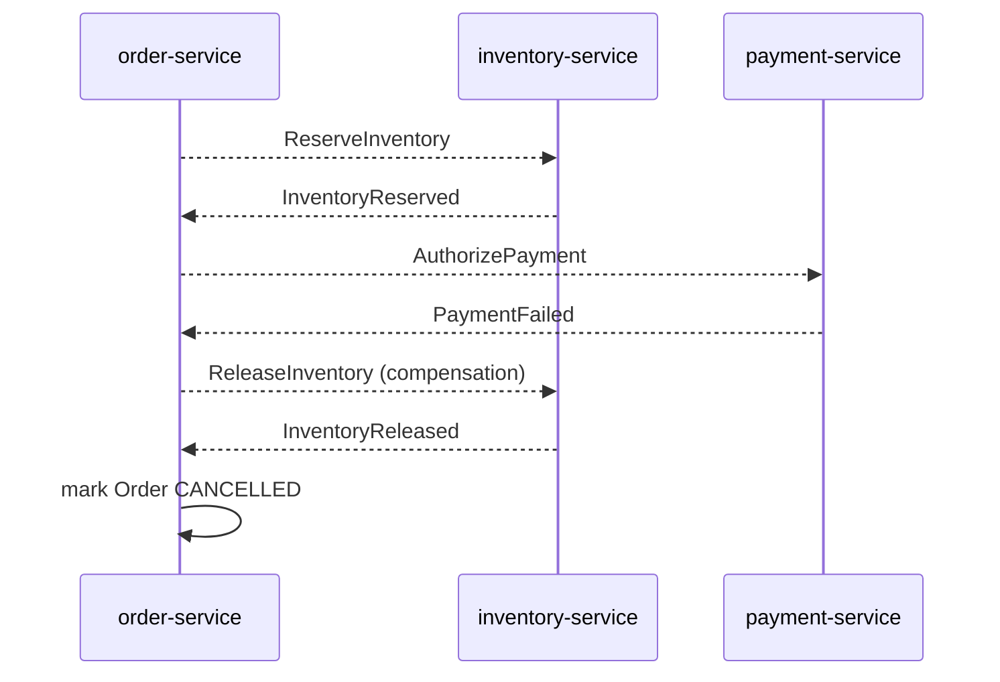

# Architecture

> See [docs/adr/](adr/) for the reasoning behind individual decisions —
> several of them, especially ADR-0003, were discovered mid-build rather
> than decided upfront.

## System context

Every inbound REST call requires a valid JWT — each service independently
validates it as an OAuth2 resource server, no gateway or shared auth layer
in front. See [Security](#security) below and
[ADR-0005](adr/0005-jwt-authentication-via-keycloak.md).

## Order saga — happy path

## Order saga — compensation path

## Service responsibilities

| Service | Owns | Does not know about |
|---|---|---|
| `order-service` | Order aggregate, the saga itself (`OrderSagaManager`), outbox | Inventory/Payment internals |
| `inventory-service` | Stock levels, reservation ledger | The saga, Order, Payment |
| `payment-service` | Authorization/void against the (mocked) gateway | The saga, Order, Inventory |

See [ADR-0001](adr/0001-saga-orchestration-over-choreography.md) for why the
saga is orchestrated from `order-service` rather than choreographed.

## Security

Each service is an independent **OAuth2 resource server** (Spring Security)
validating JWTs issued by **Keycloak** — no API gateway or shared auth layer;
every service does its own signature/issuer/expiry check against Keycloak's
`issuer-uri` via OIDC discovery. Callers authenticate with the
`client_credentials` grant (machine-to-machine only — no human end-users, no
login UI). `/actuator/health`, `/actuator/info`, `/actuator/prometheus`, and
the Swagger/OpenAPI docs endpoints are the only paths open without a token;
everything else — including the business endpoints and `/actuator/metrics`
— requires one.

This is authentication only: a valid token proves the caller is a
recognized client, not what that client is allowed to do. Fine-grained
per-endpoint authorization is explicitly out of scope for now — see the
README's Production Hardening Roadmap.

Interactive API docs (Swagger UI, per service on `/swagger-ui.html`) can
fetch a token directly from Keycloak via its Authorize button, or accept
one pasted in manually — see [ADR-0006](adr/0006-swagger-ui-authorize-and-keycloak-cors.md)
for why both options exist.

[ADR-0005](adr/0005-jwt-authentication-via-keycloak.md) covers the full
reasoning: why Keycloak over a static keypair or shared secret, why
authentication is duplicated per service rather than shared, and what's
explicitly deferred.

## Reliability mechanisms

- **Transactional outbox** — every state-changing write and its outgoing
  event commit in the same local transaction, relayed to Kafka/Redpanda by a
  polling publisher. Avoids the dual-write problem. [ADR-0002](adr/0002-transactional-outbox.md)
- **Idempotent consumers** — every consumer records processed event IDs and
  skips duplicates, since Kafka delivery is at-least-once.
- **Correlation, two distinct mechanisms**:
  - Every event/command carries a `sagaId` field (the order id) in its
    payload. Each Kafka listener puts it into the logging MDC for the
    duration of processing (`SagaMdc`), so structured logs across all three
    services can be filtered to one order.
  - Separately, OpenTelemetry trace context (`traceparent`) is propagated
    through the outbox row itself and restored before each Kafka publish —
    see [ADR-0003](adr/0003-trace-context-across-the-outbox-boundary.md) for
    why that needed to be explicit rather than automatic.
- **Multiple message types per Kafka topic**, dispatched by an `event-type`
  header rather than one topic per type — [ADR-0004](adr/0004-multiple-message-types-per-topic.md)
- **Resilience4j** circuit breaker + retry around the one real external
  call (the payment gateway), and Kafka consumer retry-with-backoff falling
  through to a dead-letter topic on all three services.

## Observability

- **Traces**: OpenTelemetry Spring Boot starter, auto-instrumenting Spring
  MVC/JDBC/Kafka, exported via OTLP to Jaeger. A single trace spans an
  entire order — HTTP request through every Kafka hop and DB query across
  all three services — per ADR-0003.
- **Metrics**: Micrometer + Prometheus, scraped from each service's
  `/actuator/prometheus`, visualized in a provisioned Grafana dashboard
  covering both infra metrics (HTTP latency, JVM heap) and saga-specific
  business counters (`keystone.orders.confirmed`, `keystone.orders.cancelled`).
- **Logs**: Spring Boot's built-in structured logging (JSON), profile-gated
  (`json-logs`) so local iteration stays human-readable by default, with
  `sagaId` correlation as described above.

## Testing

Unit tests per service, Testcontainers-backed integration tests per service
against real Postgres, and one Testcontainers-orchestrated end-to-end test
(`e2e-tests`) that launches all three service jars as real processes and
drives the actual saga over HTTP — both the happy path and the compensation
path. See the root [README](../README.md#testing) for how to run each layer.

Auth is exercised at three different fidelities rather than the same way
everywhere: MockMvc slice tests use `spring-security-test`'s `jwt()`
postprocessor (no real token needed); per-service integration tests stub
the `JwtDecoder` bean directly (no Keycloak container, since three
redundant copies of the same issuer-discovery check add little); the
end-to-end test runs a real Keycloak container and fetches a genuine
`client_credentials` token. See [ADR-0005](adr/0005-jwt-authentication-via-keycloak.md).
